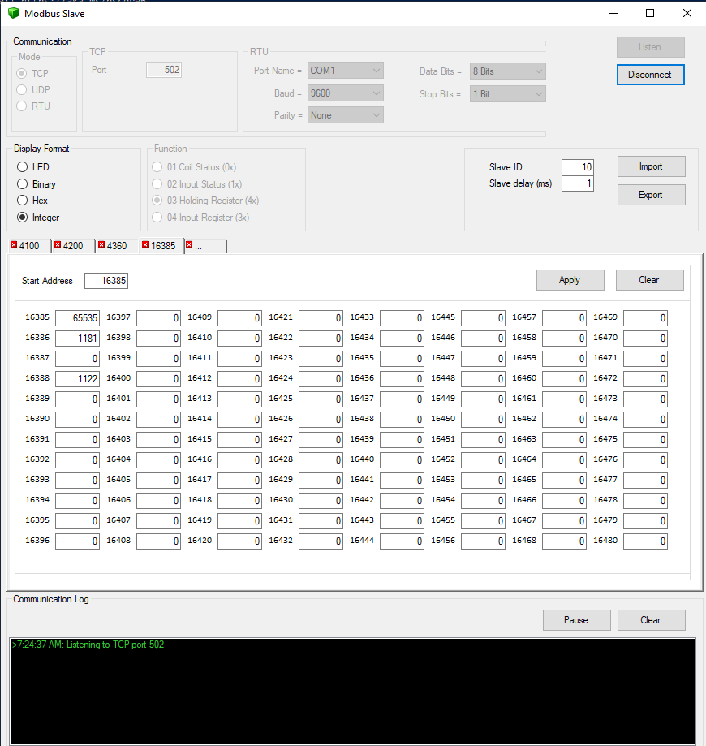

# ModbusTool
## A modbus TCP and RTU master and slave tool with import and export functionality.

|If you find this project useful or interesting, please help support further development!||
|---|---|

