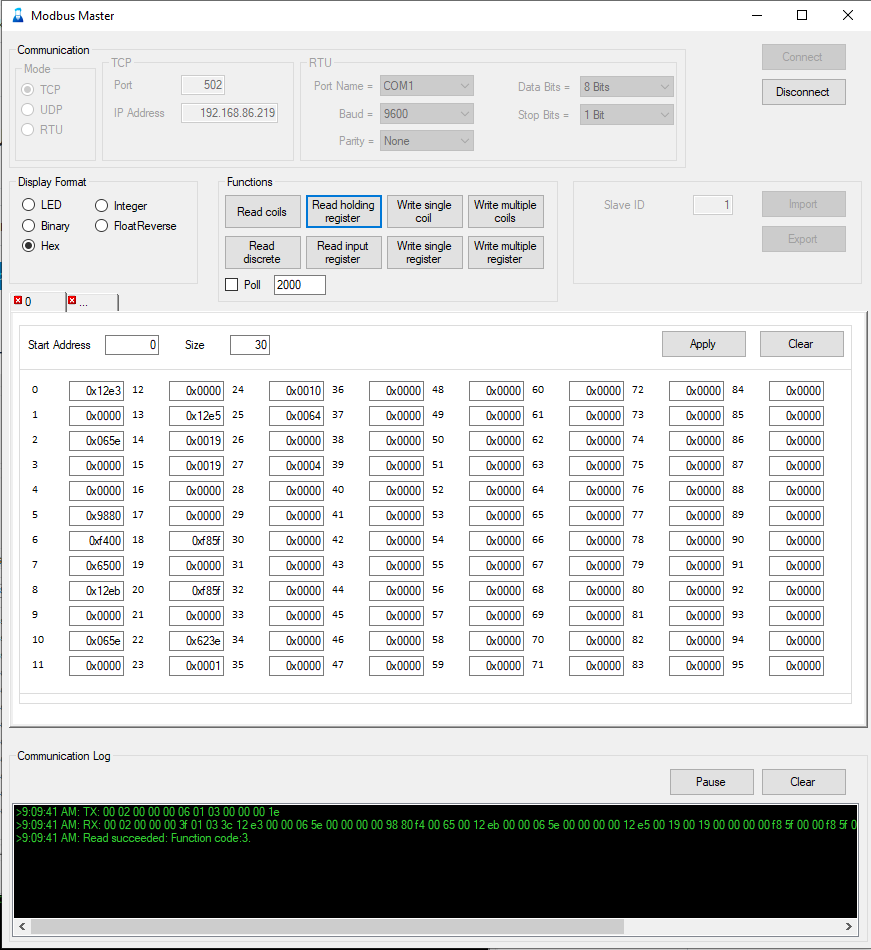

# ModbusTool
## A modbus TCP and RTU master and slave tool with import and export functionality.

<a href="https://www.buymeacoffee.com/r4K2HIB" target="_blank"></a>

[](https://hits.seeyoufarm.com)

[](https://github.com/ClassicDIY/ModbusTool/releases)
[](https://github.com/ClassicDIY/ModbusTool/releases)
[](https://github.com/ClassicDIY/ModbusTool/stargazers)
[](https://github.com/ClassicDIY/ModbusTool/issues)
[](https://github.com/ClassicDIY/ModbusTool/blob/master/LICENSE)

<p align="center">

</p>

## Installation

There are two options available to download and install ModbusTool.

### Option 1: Download from Github Releases

1. Visit the [Github Releases page](https://github.com/ClassicDIY/ModbusTool/releases) of ModbusTool.
2. Choose `ModbusTool.msi` to downloaad.
3. Once the file is downloaded, double-click on it to initiate the installation process.
4. Follow the on-screen instructions to complete the installation.

For detailed installation instructions and additional information, refer to the [Github Wiki tutorial](https://github.com/ClassicDIY/ModbusTool/wiki) dedicated to this option.

### Option 2: Install using `winget`

> `Winget` is a command-line package manager for Windows that allows users to quickly and easily install, manage, and uninstall software applications from the terminal.

1. Ensure that you have `winget` installed on your system. If not, follow the instructions to install `winget` from the official Microsoft [documentation](https://learn.microsoft.com/en-us/windows/package-manager/winget/).
2. Open a powershell or terminal window.
3. Execute the following command to install ModbusTool using `winget`:

```shell
winget install ClassicDIY.ModbusTool
```

4. Wait for the installation process to complete.

Once installed, you can launch ModbusTool and start using its master and slave test functionalities with import and export capabilities.

## License
```

 Copyright (c) 2020. ClassicDIY

  Licensed under the Apache License, Version 2.0 (the "License");
  you may not use this file except in compliance with the License.
  You may obtain a copy of the License at

       http://www.apache.org/licenses/LICENSE-2.0

  Unless required by applicable law or agreed to in writing, software
  distributed under the License is distributed on an "AS IS" BASIS,
  WITHOUT WARRANTIES OR CONDITIONS OF ANY KIND, either express or implied.
  See the License for the specific language governing permissions and
  limitations under the License.

```


## Release notes

-----------------

version 2.0.1.1
<ul>
<li>Merged <a href="https://github.com/ClassicDIY/ModbusTool/pull/18">PR</a> to fix <a href="https://github.com/ClassicDIY/ModbusTool/issues/17">issue 17</a></li>
</ul>

-----------------

version 2.0.1.0

<ul>
<li>Removed function restrictions from ModbusSlave</li>
<li>Fixed Slave Log of rx data</li>
<li>Merged PR that adds polling and Float view</li>
</ul>

-----------------
